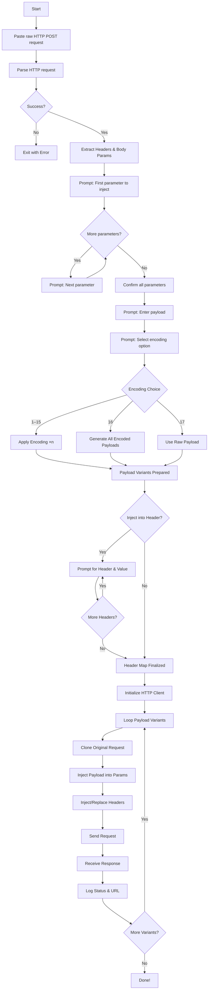

# 🕶️ BlindX

```
   ___      __    _               __   _  __  
  / _ )    / /   (_)   ___    ___/ /  | |/_/  
 / _  |   / /   / /   / _ \  / _  /  _>  <   
/____/   /_/   /_/   /_//_/  \_,_/  /_/|_|    

      BlindX v1.0 by progprnv
```

**BlindX** is a Python command-line tool for **automated Blind XSS testing**.  
It accepts raw HTTP POST requests (like those from Burp Suite), injects payloads into user-defined parameters and headers, applies various encodings, and logs the HTTP responses.

---

## 🚨 Warning

> ❗ Use this tool **only on systems you have explicit permission to test**. Unauthorized use may violate laws and ethical guidelines.

---

## 🛠️ Features

- **Raw Request Parsing**: Accepts full POST requests (headers + body).
- **Multiple Parameter Support**: Inject into one or more body parameters.
- **Header Injection**: Add or replace headers dynamically.
- **17 Encoding Options**:
  - HTML, URL, JavaScript, Unicode, Base64 — single/double/triple
  - All variants at once
  - No encoding (raw payload)
- **Batch Testing**: Sends encoded variants one by one, and logs status codes.
- **ASCII Art Banner** 😎

---

## 📥 Installation

### ✅ Option 1: via `pipx`

```bash
pip install pipx
pipx install blindx
```

### ✅ Option 2: via GitHub

```bash
git clone https://github.com/progprnv/blindx
cd blindx
pip install .
```

---

## 📋 Encoding Menu

| Option | Type             | Repeats | Sample                    |
|--------|------------------|---------|---------------------------|
| 1–3    | HTML Encode      | ×1–×3   | `&lt;`, `&amp;`, `&quot;` |
| 4–6    | URL Encode       | ×1–×3   | `%3C`, `%3E`, `%22`       |
| 7–9    | JavaScript Escape| ×1–×3   | `\'`, `\"`, `\\`          |
| 10–12  | Unicode Escape   | ×1–×3   | `\u003C`, `\u003E`        |
| 13–15  | Base64 Encode    | ×1–×3   | `PHNjcmlwdD4=`, etc.      |
| 16     | All Encodings    | 15x     | Every above combination   |
| 17     | No Encoding      | —       | Just your original input  |

---

## 🧪 Usage Example

```bash
blindx
```

And follow the prompts:
- Paste raw POST request
- Choose parameter(s) to inject
- Input payload
- Select encoding
- Optional header injection
- Tool sends requests and logs results

---

## 🧭 Workflow



---

## 📄 License

This project is released under the **MIT License**.

---

**Built with ❤️ by [progprnv](https://github.com/progprnv)**
