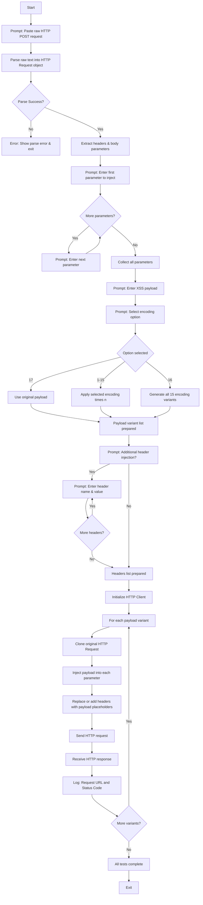

# BlindX

```
   ___      __    _               __   _  __  
  / _ )    / /   (_)   ___    ___/ /  | |/_/  
 / _  |   / /   / /   / _ \  / _  /  _>  <   
/____/   /_/   /_/   /_//_/  \_,_/  /_/|_|    

      BlindX v1.0 by progprnv
```

**BlindX** is a command-line tool for automated Blind XSS testing. Written in **Python**, it takes a raw HTTP POST request (e.g., copied from Burp Suite), injects your payload into specified parameters or headers, applies various encodings, and reports HTTP responses for each test.

---

## ⚠️ Disclaimer:
This tool is intended strictly for educational and authorized security testing purposes only. You must have explicit written permission from the system owner before conducting any tests using this tool. Unauthorized testing, especially on public domains or systems you do not own, may be illegal, unethical, and could result in criminal prosecution.

If you're using this tool on bug bounty programs, always carefully review the program's scope and rules. Some platforms strictly exclude endpoints like contact forms, feedback pages, or other blind input channels, and exploiting them may lead to disqualification, negative reputation points, or even permanent bans.

🛑 The developer of this tool takes no responsibility for any misuse or illegal activity. Use wisely, stay ethical, and always test responsibly.
---

## 🛠️ Detailed Workflow



---

## ⚙️ Features

* **Raw Request Parsing**: Accepts full HTTP POST requests (headers + body).
* **Parameterized Injection**: Inject into one or more body parameters.
* **Header Injection**: Add or replace headers with payload placeholders.
* **Multiple Encodings**: Choose from 15 single/double/triple encodings (HTML, URL, JS, Unicode, Base64), all together, or none.
* **Batch Execution**: Sends all variants and displays URL + HTTP status code.

---

## 📥 Installation

1. **Install via pipx** (recommended)

   ```bash
   pipx install blindx
   ```

   Or via pip:

   ```bash
   pip install blindx
   ```

2. **Run it**:

   ```bash
   blindx
   ```

---

## 📋 Encoding Details

| Option | Encoding Type     | Variations | Description                 |
| ------ | ----------------- | ---------- | --------------------------- |
| 1–3    | HTML Escape       | ×1, ×2, ×3 | `&lt;` / `&gt;` / etc.      |
| 4–6    | URL Encode        | ×1, ×2, ×3 | `%3C` / `%3E` / etc.        |
| 7–9    | JavaScript Escape | ×1, ×2, ×3 | `\'` / `\"` / `\\` escapes  |
| 10–12  | Unicode Escape    | ×1, ×2, ×3 | `\u003C` / `\u003E` / etc.  |
| 13–15  | Base64 Encode     | ×1, ×2, ×3 | `PHNjcmlwdD4=` etc.         |
| 16     | All Variants      | 15 total   | Runs all above in sequence  |
| 17     | None              | —          | Original payload unmodified |

---

## 📄 License

This project is released under the **MIT License**.

---

